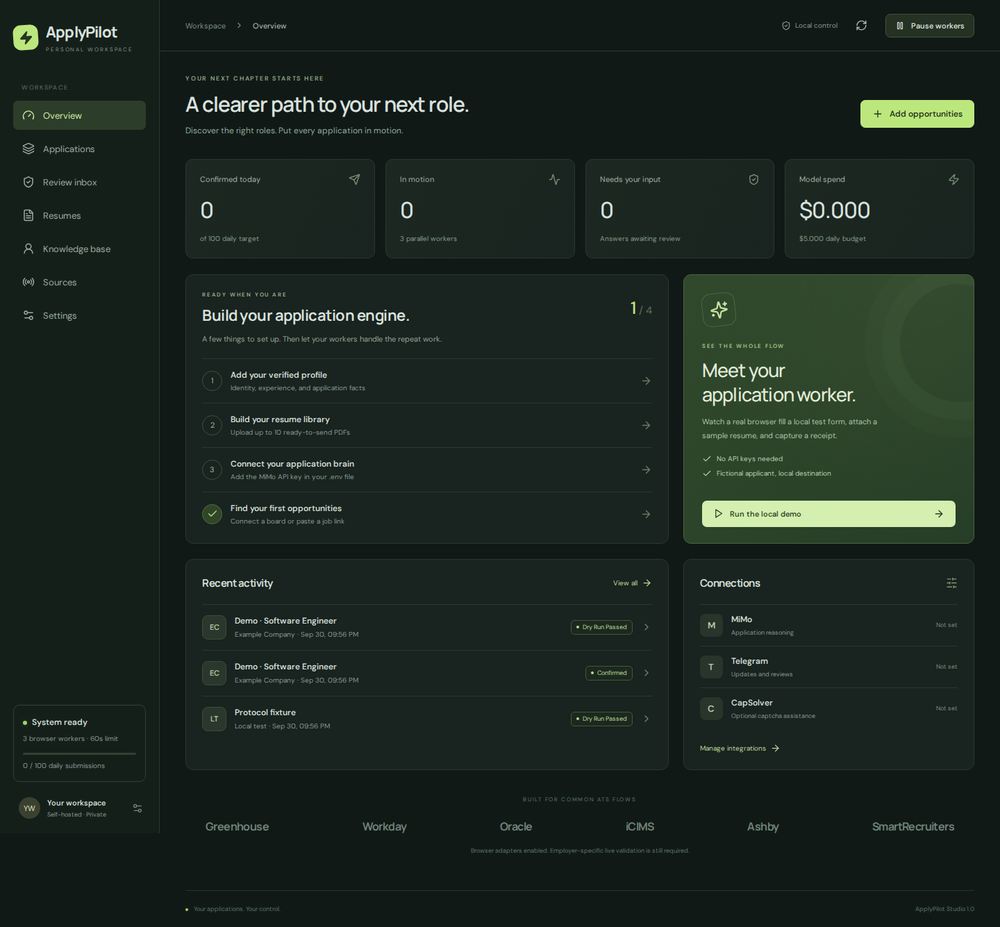

# ApplyPilot Studio

A self-hosted application workspace with a real browser worker, an evidence-backed answer engine, a fixed resume library, and a Telegram control channel.

**Autonomous engine:** deterministic drivers for Workday, Oracle Recruiting, iCIMS, Taleo, SuccessFactors and other multi-page portals; one shared login per portal (created, verified and reset through your Gmail automatically); a knowledge base that learns from your Telegram answers. See [why the old engine failed and how this one works](docs/autonomous-engine.md).

This replaces the previous ApplyPilot CLI. The old version is preserved on [`archive/pre-studio-2026-10-01`](https://github.com/premalshah999/ApplyPilot/tree/archive/pre-studio-2026-10-01). There is no Claude Code runtime dependency and no CV tailoring step.



## Start with Docker

Requirements: Docker Engine with Compose; an x86-64 or ARM64 Linux host with approximately 4–8 GB available RAM for three browsers. Start with fewer workers on a small machine.

```bash
git clone https://github.com/premalshah999/ApplyPilot.git
cd ApplyPilot
cp .env.example .env
docker compose up --build -d
docker compose exec app jobpilot verify
docker compose exec app jobpilot token
```

Open **http://127.0.0.1:8080**, paste the token, and choose **Run the local demo**. No provider keys are required. A real Chromium process fills a synthetic applicant's form, uploads a synthetic PDF, submits to this installation, and captures a receipt. Demo submissions never count toward real application statistics.

`jobpilot verify` must print **PASS** before you add credentials. It checks authentication, database access, built dashboard assets, a dry run with zero received submissions, and one browser submission with the expected answers and PDF checksum. It saves hashes of the receipt, answer ledger, and screenshot in the private data directory and exits nonzero on failure. It exercises only this installation's synthetic form; it does not certify live ATS or provider behavior.

Check persistence after a restart:

```bash
docker compose restart app
docker compose up -d --wait --wait-timeout 120
docker compose exec app jobpilot verify --recheck /app/.data/verification.json
```

The first build downloads Chromium and Python dependencies. PostgreSQL and applicant files live in separate persistent Docker volumes. Do not use `docker compose down -v` unless you intend to delete that data.

## Add your integrations

Edit `.env`, then recreate the application container:

```dotenv
MIMO_API_KEY=your-key
MIMO_BASE_URL=https://api.xiaomimimo.com/v1
MIMO_MODEL=mimo-v2.6-pro
TELEGRAM_BOT_TOKEN=your-bot-token
TELEGRAM_USER_ID=your-numeric-telegram-user-id
CAPSOLVER_API_KEY=your-key
# One login for every employer portal, plus Gmail for codes, links and password resets.
ACCOUNT_EMAIL=you@gmail.com
ACCOUNT_PASSWORD=Example!Passw0rd
GMAIL_ADDRESS=you@gmail.com
GMAIL_APP_PASSWORD=abcd efgh ijkl mnop
```

```bash
docker compose up -d --force-recreate app
```

Keys remain on the server; the dashboard only receives connection flags. Telegram and CapSolver are optional. MiMo is needed for classification, evidence-based prose answers, and browser navigation on real applications. Use the actual pricing of your provider in `MIMO_INPUT_PRICE` and `MIMO_OUTPUT_PRICE`; the displayed cost is an estimate, not an invoice.

Then:

1. Save your identity, first/last-name facts, eligibility facts, preferences, and experience evidence in **Knowledge base**.
2. Upload your 8–10 prepared, text-based PDF resumes in **Resumes**, with role tags.
3. Paste a job URL in **Applications** or connect a company board in **Sources**.
4. Classify the role. Inspect the match and chosen resume. Missing eligibility evidence requires review; you can manually approve a match with an explanation.
5. Run a **Dry run** on a representative employer. Read the answer ledger and screenshot.
6. Enable **Automatic submission** in Settings when you are ready. Apply to approved jobs, or enable classification and auto-queue on each source.

Required answers without adequate evidence go to the review inbox. After resolving them, approve and requeue the job. The next run freezes a new profile snapshot containing the approved answers.

## What is implemented

| Area | Behavior |
| --- | --- |
| Dashboard | Overview, job imports, classification, match approval, queue, receipts, screenshots, review inbox, resume uploads, profile facts, source schedules, controls |
| Browser | Real Chromium, observed-control IDs, frames and open shadow roots, native and ARIA controls, Workday listbox buttons/prompts/date parts, Oracle pills, hidden selects behind select2/chosen, virtualized lists, read-back verification |
| ATS adapters | Deterministic state machines for Workday, Oracle, iCIMS, Taleo, SuccessFactors, Eightfold and a generic multi-page driver: classify step → act → verify → repair flagged fields; navigation model only for unrecognized pages |
| Fast path | Single-page forms on Greenhouse, Lever, Ashby, SmartRecruiters, Workable, and BambooHR fill directly before invoking the navigation model |
| Answers | Exact approved answers → knowledge base → structured profile (names, address, phone, work/education rows) → screening facts → standard-consent policy → demographic decline → MiMo with resume, evidence and similar answers; unknown required questions go to Telegram |
| Accounts | One `ACCOUNT_EMAIL`/`ACCOUNT_PASSWORD` for every portal: sign in, create on first use, verify by email, reset an old password through Gmail; password typed only on the employer or its ATS auth hosts |
| Resumes | Select one existing PDF, freeze its checksum, verify attachment, retain a checksum in the receipt; never rewrite a CV |
| Scheduling | Five-field cron per source, durable DBOS queues, three concurrent browsers by default, one application at a time per employer host |
| Duplicate protection | Canonical job identity, atomic active-run checks, duplicate-delivery guards, uncertain-submission reconciliation, no blind resubmission |
| Budgets | 100 submission reservations/day, 180-second active attempt budget, 18 model calls/run, $5 estimated model budget/day by default |
| Telegram | Questions arrive while the worker waits; reply to the message (or tap/number an option) and the run continues; answers are learned. `/status`, `/queue`, `/pause`, `/resume`, `/apply URL`, `/answer`, `/learn Q = A`, `/kb`, `/forget`, `/accounts`; numeric sender allowlist; jobs requeue automatically once answered |
| CapSolver | reCAPTCHA v2/invisible/Enterprise/v3 and Turnstile detected from markup or iframe URLs, image captchas; bounded attempts per run |
| Employer login | Automatic with the shared login; headed session capture only for SMS/passkey portals |
| Email verification | Gmail app password over IMAP (or app-owned OAuth): built-in ATS sender rules, employer correlation, one-time consumption, codes and links never shown to the model ([details](docs/autonomous-engine.md), [OAuth setup](docs/email-verification.md)) |
| Debugging | Per-step HTML + screenshot + decision trace; `jobpilot probe URL` (dry run with printed trace) and `jobpilot trace RUN_ID` |
| MCP | Read-only stdio server for application/run/email status from coding assistants ([setup](docs/mcp.md)) |

## ATS coverage — read this before scaling

The system detects these ATS families and supplies navigation guidance to the same verified form engine. **Detection and guidance are implemented; they are not a claim that every employer-specific flow has been validated.**

| ATS | Discovery | Application handling | Common review boundary |
| --- | --- | --- | --- |
| Greenhouse | Public board API | Browser + single-page fast path, frames, custom fields | Captcha, unusual controls |
| Lever | Public postings API | Browser + single-page fast path | Custom screening fields |
| Ashby | Public job-board API | Browser + single-page fast path, dependent questions | Custom widgets |
| SmartRecruiters | Public postings API | Hosted applicant page + fast path | Extra screening or account requirements |
| Workday | Public CXS listing requests for conventional tenant/site URLs | Adapter: account create/verify/sign-in/reset, all wizard pages, rows, prompts, dates | Tenant-specific custom questions, SMS/passkey sign-in |
| Oracle Recruiting | Import job URL or crawl public career-page links | Adapter: email + terms, emailed PIN, apply-flow sections, pills, e-signature | Tenant-specific sections such as mandatory experience rows |
| iCIMS | Import job URL or crawl public career-page links | Adapter: in-frame content, email step, sign-in/create/reset, hidden selects | Auth0-style central logins, unusual embedded forms |
| Taleo | Import URL / public links | Adapter: login/New User, privacy agreement, Save and Continue pages | Security questions on registration |
| SuccessFactors / Eightfold | Import URL / public links | Adapter: account page, long form with "Apply" / resume-first form, email code | Tenant-specific widgets |
| Workable / BambooHR | Import URL / public links | Browser + single-page fast path | Employer-specific controls |
| Other sites | Import URL / public links | Observed-control browser fallback | Unsupported widgets or authentication |

Public job-listing APIs are used for discovery, not unauthenticated employer submission APIs. Career-page discovery extracts links from returned HTML; it does not crawl an entire JavaScript site. Sources cap each sweep at 500 jobs, with at most 100 new jobs classified when auto-queue is enabled.

**80–100 high-quality applications/day and sub-minute completion are operating targets, not guarantees.** The queue enforces the configured limits. Actual throughput depends on eligible jobs, model latency, employer forms, authentication, and review rate. A run that exceeds its budget stops; it does not silently keep spending. Cleanup and queue wait are separate from the active attempt budget. Manual requeues are new attempts.

No real employer submissions were made during development. The local demo and browser tests are synthetic. MiMo inference, Telegram delivery, CapSolver billing, and live ATS behavior must be checked with your accounts.

## Native development / VS Code / Codex

Requirements: Python 3.12 or 3.13, [uv](https://docs.astral.sh/uv/), Node 22.12+ or 24+, and Chromium system dependencies. Use Linux, macOS, or WSL2.

```bash
cp .env.example .env
uv sync --frozen
uv run playwright install --with-deps chromium
cd frontend
npm ci
npm run build
cd ..
uv run jobpilot token
uv run jobpilot serve
```

Native development defaults to two SQLite databases under `.data`. Docker uses PostgreSQL for both the application tables and DBOS's separate schema. Run **one application server process**; it owns the configured concurrent browser workers. Do not add Uvicorn workers or scale the app container horizontally with this version's startup-recovery logic.

For frontend hot reload, run `npm run dev` inside `frontend`, keep the backend on port 8080, and set `BASE_URL=http://127.0.0.1:5173` before starting the backend. The Vite proxy forwards API requests; origin checks require the configured URL.

```bash
uv run jobpilot doctor
uv run jobpilot verify
uv run ruff check jobpilot tests
uv run ruff format --check jobpilot tests
uv run pytest -q
```

The browser tests launch owned local fixtures. Install Chromium and build the dashboard before running all of them. An optional `CHROMIUM_PATH` selects a compatible locally installed executable. `ARTIFACT_DIR` controls where UI-test screenshots are written.

The GitHub workflow installs the locked dependencies, builds the dashboard, runs the browser tests, starts the production Docker/PostgreSQL stack, runs `jobpilot verify`, and checks the saved evidence after restarting the app. It uploads a `deployment-evidence` artifact. The workflow also supports manual dispatch from GitHub Actions. A configured workflow is not a successful run; check its actual result before relying on it.

## Login-required employers

On a machine with a visible display:

```bash
uv run jobpilot login 'https://employer.wd5.myworkdayjobs.com/en-US/Careers'
```

This is only needed for portals that use SMS, authenticator apps or passkeys; ordinary email/password portals are handled with `ACCOUNT_EMAIL`/`ACCOUNT_PASSWORD`. Sign in yourself, navigate to the application, then press Enter in the terminal. Studio stores only that employer's cookies and local storage in `.data/sessions`. For Docker, upload the generated `.json` file and the same employer URL under **Settings → Employer sessions**. Sessions are credentials: keep them private. Expired cookies, MFA, cross-domain authentication, and employer-specific verification can still require another capture.

For email OTPs and verification links, set `GMAIL_ADDRESS` and `GMAIL_APP_PASSWORD` (Gmail app password with IMAP enabled), or use the OAuth connection in [the Gmail setup guide](docs/email-verification.md). SMS verification remains unsupported.

## Answer policy

Demographic fields select a listed decline option when available. Missing decline options on required fields go to review.

Disclosure facts and consent commitments are different. Supply accurate facts for convictions, government employment, NDA restrictions, referrals, sponsorship, and work authorization. The engine does not convert all such questions to “No”: negation, time scope, public-university employment, and promises to follow anti-corruption policies can change the answer. Standard privacy/terms/accuracy-certification checkboxes are accepted automatically when *auto accept consents* is on (marketing and SMS opt-ins never are); approve other exact consent labels or answer them once on Telegram.

Question reuse is scoped to the employer, normalized label, section, and exact option set. Model-generated answers must cite known fact/evidence IDs and choose a valid option. This prevents unsupported IDs and many guessing failures; it does not mathematically prove a model's interpretation. Audit representative answers before increasing volume.

## Data and recovery

The application binds to loopback by default. Access requires a token; browser sessions use HttpOnly, SameSite cookies. For a remote installation, use an HTTPS reverse proxy, set the exact `BASE_URL`, and set `SECURE_COOKIES=true`. Keep the database port and CDP ports private.

Resumes, browser sessions, profile snapshots, screenshots, answer ledgers, and workflow data are private runtime data, excluded from Git. On a native install, back up `.data`; with Docker, back up both named volumes while the app is stopped. The **Remove** resume action removes it from the selectable library; immutable bytes are retained for historical runs. There is no automatic data-retention deletion.

When a worker is interrupted before submission, the run requires review. If interrupted during the commit step, it becomes **submission unknown**. Check the employer portal or confirmation email, open its run details, and reconcile the result before another attempt is permitted. Exactly-once effects cannot be guaranteed across an external website and a local database; the app favors holding an uncertain result over creating a duplicate.

See [architecture](docs/architecture.md), [operations](docs/operations.md), and [validation](docs/validation.md) for implementation and operating details.

The [autonomous engine](docs/autonomous-engine.md) implements account creation, mailbox verification, the learning knowledge base and the ATS adapters; it is tested against mock ATS sites, not live tenants. The [MCP server](docs/mcp.md) provides read-only status tools for your coding assistant. The earlier [unattended agent design](docs/unattended-agent.md) is kept for reference.

## Open source

AGPL-3.0, retaining the repository's original license. The predecessor was [Pickle-Pixel/ApplyPilot](https://github.com/Pickle-Pixel/ApplyPilot). This Studio rewrite preserves that provenance while replacing the old runtime. Dependencies keep their own licenses; see [third-party notices](docs/third-party.md).
