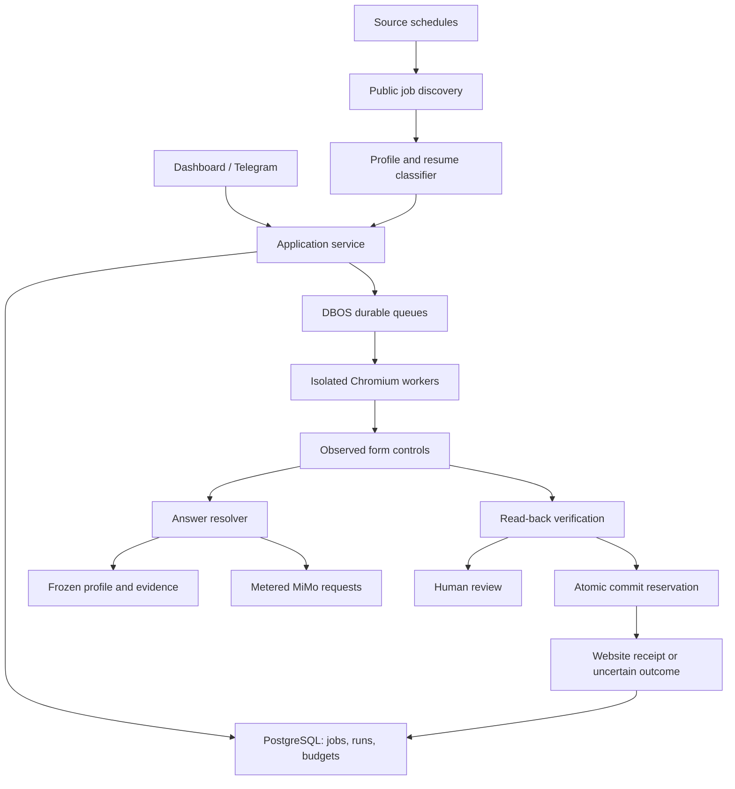
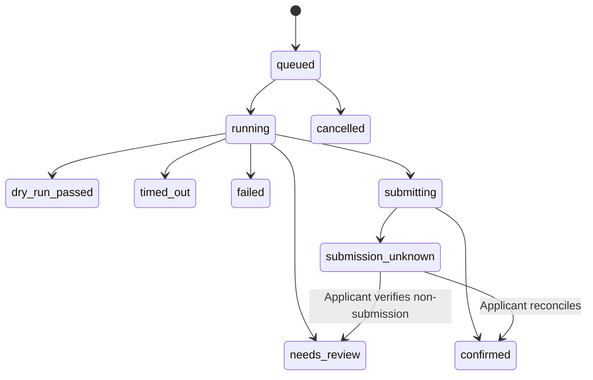

# Architecture

This page describes the implemented runtime. Gmail connections and dedicated email-code/link verification are implemented in [the email workflow](email-verification.md). The broader answer and account-creation replacement remains proposed in [Unattended application agent](unattended-agent.md).

## Modules

- `api.py`: token/cookie authentication, origin checks, bounded PDF/session upload, dashboard API, owned demo, static assets.
- `db.py`: application schema and short serialized business transactions. SQLite uses `BEGIN IMMEDIATE`; PostgreSQL uses an application advisory transaction lock.
- `service.py`: queue admission, immutable application packets, submission reservations, transitions, reviews, reconciliation.
- `workers.py`: DBOS workflow delivery, global/host concurrency, source cron scheduler, startup recovery.
- `ats.py` / `discovery.py`: host-boundary detection, canonical URL identity, public ATS feeds, existing-resume classification.
- `answers.py`: exact answer cache, identity facts, demographic decline policy, consent approval, model answer validation.
- `forms.py`: frame observations, stable control IDs, actual option labels, uploads, fill actions, read-back checks, answer ledger.
- `browser.py`: browser lifetime, navigation agent, fast path, submission guard, timeout, proof capture.
- `adapters/`, `widgets.py`, `js/scan.js`, `accounts.py`, `inbox.py`, `knowledge.py`: the autonomous engine (ATS state machines, widget drivers, shared login, Gmail IMAP verification, learned answers); see [autonomous engine](autonomous-engine.md).
- `models.py`: one metered HTTP transport for navigation, classification, and question answering.
- `telegram.py` / `capsolver.py`: optional external integrations.
- `frontend/`: React/TypeScript/Vite dashboard. Fonts are bundled locally.

## Form interaction

The navigation model receives inspected control IDs and six limited application tools. Generic Browser Use typing, JavaScript execution, shell access, arbitrary uploads, and navigation tools are excluded. It can inspect, request evidence-based filling, click observed navigation controls, request review, attempt a supported captcha once, and request the commit step. The application code owns candidate answers and the selected resume file.

Uploads precede other fields, because resume parsing may overwrite them. Native selects use option labels; radio groups select exact labels; custom comboboxes expose observed options and commit a real option click. Each filled value is read back. Required fields without a verified answer, mismatched values, invalid controls, and missing attachments block completion. Dependent fields are reinspected. Unsupported controls stop for review.

Answers and verification from earlier pages remain in the ledger with document-specific IDs. A previously verified upload can carry across wizard pages; the app cannot prove every ATS's server-side attachment state without employer-specific receipt support. Review these cases during onboarding.

## Execution and recovery

Admission checks are serialized. Active or confirmed runs block another application for the same canonical identity. The browser freezes a profile snapshot and resume checksum at queue time. Only an atomic `queued → running` transition owns a browser attempt, so duplicate workflow deliveries return without interrupting the owner.

Immediately before submission, the service rechecks pause state, submission permission, mode, and the shared daily cap, then persists `submitting`. A click alone never means success. An explicit confirmation page that differs from any prior confirmation is required; otherwise the result is uncertain. A failure after commit intent is also uncertain. Retry is a new user-authorized attempt after reconciliation, not an automatic replay.

Startup recovery is designed for a **single server process with concurrent browser workers**. It marks interrupted `running` rows for review and `submitting` rows as uncertain before DBOS delivery starts. Queued rows form a business outbox and are delivered again on startup. Never run two server processes against these application tables until distributed ownership leases are implemented.

## Model compatibility

The lockfile deliberately pins Browser Use 0.13.10 with PydanticAI 1.70.0 and OpenAI SDK 2.26.0. Newer PydanticAI 2.x releases require a conflicting OpenAI SDK. Upgrade these together and run the scripted-provider integration test.

MiMo uses the OpenAI-compatible endpoint and JSON object mode. PydanticAI's prompted output supplies the schema; Python validates the result. Browser Use supplies its action schema in the prompt; the transport rewrites strict-schema response format to JSON object mode and normalizes the completion-token parameter. Provider defaults for thinking remain provider-controlled.

All model calls pass through the same budget ledger. Before each request, a conservative token estimate reserves spend in a short transaction. Provider usage reconciles the estimate; on network failure the reservation is retained because billing is uncertain. The reported estimate excludes hosting, storage, and CapSolver charges. Cached-token discounts are not modeled. Token prices are operator configuration.

## Boundaries

Job text and website text are untrusted data. Model prompts delimit their role; field validation and restricted tools limit the effects of incorrect model instructions. This is not a proof against all prompt injection or all possible website side effects.

Server-side URL fetches reject local/private IP destinations and check redirects. Browser requests reject private destinations except the owned demo. Guards cover observed final controls and known final endpoint patterns; unknown sites may autosave personal data during a dry run. Use OS/container egress isolation on an untrusted network. DNS validation does not replace an outbound firewall and is not a complete DNS-rebinding defense.

App-owned Gmail OAuth and dedicated email verification use `mail.py`, `mail_api.py`, and `email_browser.py`: encrypted refresh tokens, bounded pending challenges, exact sender/recipient/time checks, one-use consumption, and a Chromium redirect guard. Email wait time counts toward the application deadline and holds its worker slot. See [email setup and limitations](email-verification.md).

The [read-only MCP server](mcp.md) calls fixed authenticated API endpoints and exposes no verification secrets or mutation tools. Password/account creation, SMS/passkeys, unrestricted inbox access, stealth fingerprinting, and arbitrary remote code execution remain unsupported. Those flows become review items.

## Primary references

- [MiMo chat API](https://mimo.mi.com/docs/en-US/api/chat)
- [MiMo structured output](https://mimo.mi.com/docs/en-US/quick-start/usage-guide/text-generation/structured-output)
- [Browser Use](https://github.com/browser-use/browser-use)
- [PydanticAI output modes](https://ai.pydantic.dev/output/)
- [DBOS Python](https://docs.dbos.dev/python)
- [Greenhouse Job Board API](https://developers.greenhouse.io/job-board.html)
- [Lever Postings API](https://github.com/lever/postings-api)
- [Ashby public job posting API](https://developers.ashbyhq.com/docs/public-job-posting-api)
- [SmartRecruiters Posting API](https://developers.smartrecruiters.com/docs/posting-api)
