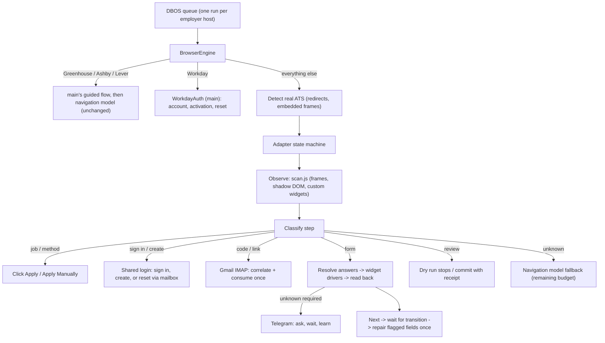

# Autonomous engine: why Workday, Oracle and iCIMS failed, and what replaced it

Status (2026-10-03): implemented and covered by end-to-end tests against high-fidelity **mock** ATS
sites (`tests/mock_ats/`), then merged with `main` (see [integration.md](integration.md) for what
changed, the trust rules, the migration note and the live-results table). It has **not** been run
against live employer tenants from this environment (outbound access to ATS hosts is blocked here).
Use `jobpilot probe URL` on your own machine to validate each tenant before turning on automatic
submission, and send failing traces back.

## 1. Root causes in the previous engine

Greenhouse and Ashby worked because they are mostly single-page forms that the "fast path" could
fill without navigation. Workday, Oracle and iCIMS failed for structural reasons, not for missing
prompts:

| # | Cause in the code | Effect on Workday / Oracle / iCIMS |
| - | --- | --- |
| 1 | `forms.fill_current()` turned **any password field** into a "session" review | Every Workday tenant and most iCIMS/Taleo portals require sign-in or account creation: the run stopped at the first page |
| 2 | The page scanner only saw native inputs, `role=combobox` and `role=radiogroup` | Workday dropdowns are `button[aria-haspopup=listbox]`, "How did you hear" is a multiselect prompt, dates are spinbutton parts, Oracle uses `cx-select-pills`; these were invisible or treated as navigation buttons |
| 3 | Navigation of every non-single-page form went through the Browser Use agent with a 16-step cap, 18 model calls and a hard **180-second maximum** (`le=180` in config) | A 6-page Workday wizard with account creation cannot finish in 16 model decisions/180 s; it timed out or stopped "without verified completion" |
| 4 | MiMo v2.6 thinks by default; `thinking` was never sent | Each navigation/answer call was slow and reasoning consumed the 2,400-token output budget, truncating JSON |
| 5 | Email verification required a hand-written **mail rule per employer** (sender domains + link origins) and OAuth | New tenants always lacked a rule, so every emailed code/link stopped the run |
| 6 | Approved answers were keyed by `sha256(label, section, options, employer)` | An answer given for one employer was never reused for the next; the same 10 questions came back for every job |
| 7 | Required checkboxes needed an exact pre-approved label | Every "I agree to the privacy policy" variant stopped the run |
| 8 | Review answers did not resume anything | After answering on Telegram you still had to find and requeue the job manually |
| 9 | Fixed sleeps (250-350 ms) after clicks/uploads | Workday/Oracle were still saving or parsing when the next scan ran |
| 10 | CapSolver only read `.g-recaptcha[data-sitekey]`/`.cf-turnstile`, once, only when the model asked | Iframe-only, invisible and Enterprise reCAPTCHA were never detected |

## 2. Architecture now



Code map:

| Module | Responsibility |
| --- | --- |
| `jobpilot/js/scan.js` | One observation per frame: fields (native, ARIA, Workday dropdown/prompt/date parts, Oracle pills, hidden selects behind select2/chosen), required/valid/error state, row group ("Work Experience 2"), controls, headings, errors, `data-automation-id`s, busy indicators. Password and OTP values are masked. |
| `jobpilot/widgets.py` | Drivers that commit a real option and read it back: virtualized listboxes (type-ahead incl. aliases), searchable comboboxes, Workday prompts (search, then browse categories), date parts, pills, hidden selects, checkboxes. Option matching with aliases (USA, NY, MS, Mobile/Cell); ambiguity returns nothing, never a guess. |
| `jobpilot/forms.py` | Fill loop: upload resume first, discover options, resolve, fill, re-scan for dependent fields (up to 3 rounds), drop questions that disappeared, verify. Network/busy-aware `settle()` instead of fixed sleeps. |
| `jobpilot/answers.py` | Local answers before the model: knowledge base, structured profile (names, address parts, phone parts, work/education rows), screening intents mapped to your facts (authorization, sponsorship, age, prior employment, non-compete, relocation, salary, start date, referral source...), negation guard, standard-consent policy, demographic decline (including context from sibling checkboxes). The model gets the selected resume text, similar learned answers and the job description. |
| `jobpilot/knowledge.py` | Learned answers: employer names normalized to a placeholder, option-compatible reuse, employer-scoped motivation prose, similar-question retrieval, live Telegram ask-and-wait. |
| `jobpilot/mail.py` + `jobpilot/inbox.py` | `mail.py` (main's MailService) is the only mailbox reader: Google's receiving DMARC alignment, sender in the employer's rule (or an aligned subdomain / employer-owned domain for Oracle, iCIMS, Taleo...), exact recipient, request window, tenant identity, exactly one match, one-use consumption, codes sealed in the vault. `inbox.py` lets adapters open the request window before the site sends mail (shared-sender lease) and wait on it. |
| `jobpilot/accounts.py` | main's encrypted `AccountStore` (one email + one shared password for every portal, generated once when `APPLICATION_PASSWORD` is unset) plus the adapter view: per-origin state (created_locally, verification_pending, authenticated, reset_requested, password_reset, exists, locked), password typed only on the employer host or the ATS's own auth hosts. |
| `jobpilot/adapters/` | `base.py` generic multi-page driver; `workday.py`, `oracle.py`, `icims.py`, `others.py` (Taleo, SuccessFactors, Eightfold). Handoff when a career site moves to a known ATS. |
| `jobpilot/capsolver.py` | main's `CaptchaSolver`: CapSolver token tasks (reCAPTCHA v2/invisible/Enterprise/v3 via hooks, Turnstile), ImageToText for classic text images, and 2Captcha `CoordinatesTask` for hCaptcha puzzles with a puzzle-only crop, separate instructions, pixel-ratio-safe coordinate mapping, per-round re-observation, stale-solution and out-of-bounds rejection, and acceptance only when the site closes the challenge with a token. |

### Account flow (same email + password everywhere)

1. Sign-in page → sign in. Bad credentials and no account known → open "Create account".
2. Create page → fill profile identity + email + password twice + consent → create. If the realm
   is already known, switch to sign-in instead. "Already exists" → sign in.
3. Verification link/code → read from Gmail, open/enter in the same browser, return to the job.
4. Sign-in still fails (an older account with a different password) → **Forgot password** → reset
   email → set `ACCOUNT_PASSWORD` → sign in. Bounded: once per run, three times per tenant.
5. SMS/passkey/authenticator challenges defer the job; `jobpilot login URL` saves a session once.

### Unknown questions

The resolver answers locally where it can (no model call). For the rest, MiMo answers from
your evidence or returns "review". Review questions go to Telegram **immediately**, while the
browser waits (`TELEGRAM_WAIT_SECONDS`, the run's deadline is extended by that wait). Reply to the
message (or tap an option, or send the option number). The answer is stored in the knowledge base
and applied to the open form; the same question at any later employer is answered without asking.
If you answer after the wait, the job requeues automatically once all its questions are answered.

## 3. Setup

```dotenv
MIMO_API_KEY=...
MIMO_THINKING=disabled
ACCOUNT_EMAIL=you@gmail.com
ACCOUNT_PASSWORD=Example!Passw0rd    # 10-20 chars, upper+lower+digit+one of ! @ # $ % *
GMAIL_ADDRESS=you@gmail.com
GMAIL_APP_PASSWORD=abcd efgh ijkl mnop
TELEGRAM_BOT_TOKEN=...
TELEGRAM_USER_ID=...
CAPSOLVER_API_KEY=...
```

1. Gmail: enable 2-Step Verification, create an app password (Google Account → Security → App
   passwords), enable IMAP (Gmail settings → Forwarding and POP/IMAP). `jobpilot doctor --check-mail`
   logs in once.
2. Dashboard → Knowledge base → **Application profile**: legal names, address, phone code/type,
   referral source. Click **Extract from resume** to propose work history and education (review
   the JSON, then save). Add screening facts in *Verified facts*, e.g.
   `{"work_authorized_us": true, "requires_sponsorship": false, "over_18": true,
   "previously_employed_here": false, "has_non_compete": false, "willing_to_relocate": true}`.
3. Run `jobpilot probe <job url>` for one posting per ATS you target. It runs a dry run (never
   submits), then prints each step: what was recognized, which fields were filled, errors, controls.
   Snapshots (HTML + JPEG) are under `.data/runs/<id>/steps`.
4. Enable automatic submission when dry runs pass.

Security note: one password everywhere is what you asked for, and it is also the largest risk in
this setup. A leak at one employer exposes the rest. Prefer a dedicated mailbox for applications,
and rotate the password by changing `ACCOUNT_PASSWORD`: the reset flow moves tenants over as they
are used. The password itself is never stored in the database (only an HMAC fingerprint that tells which tenants already use the current password), sent to the model or Telegram, or written to traces.

## 4. Verified on fixtures (tests/test_adapters.py)

| Flow | What is exercised | Fixture time |
| --- | --- | --- |
| Workday, new candidate, **submit** | cookie wall, Apply → Apply Manually, create account behind `click_filter`, emailed activation link, sign in, 6 pages: multiselect prompts with categories, virtualized country/state lists, dependent State field, Work Experience/Education rows, month/year spinbuttons, current-job checkbox hiding "To", resume upload with async parse, knowledge-base answer learned at another employer, voluntary disclosures, disability self-ID, review, receipt | ~29 s |
| Workday, existing account | "already exists" → sign in, dry run, nothing submitted | ~25 s |
| Workday, old password | sign-in fails → forgot password → reset email → new password → sign in | ~31 s |
| Oracle, new candidate, **submit** | email + terms, two apply-flow pages, read-only and async-search comboboxes, pills, resume, e-signature, receipt | ~11 s |
| Oracle, returning candidate | emailed PIN into 6 split inputs, model declines a motivation question → asked on Telegram → reply → learned → continue | ~12 s |
| iCIMS, new candidate, **submit** | `in_iframe` content, email step + privacy checkbox, create profile with password, resume, hidden native select behind chosen widget, screening, receipt | ~8 s |
| iCIMS, wrong password | invalid credentials → reset link by email → new password → sign in | ~12 s |
| Taleo, new user, **submit** | login fails → New User (email as user name) → privacy agreement → Save and Continue pages → review → submit | ~10 s |
| SuccessFactors-style | account with country + data-privacy consent → one long form whose final button is "Apply" | ~5 s |

All of these run **without a single model call**. Real tenants add network latency and their own
variations; expect roughly 1-3 minutes for a Workday application with account creation.

## 5. Known limits and what to send back

- Live tenants differ. The adapters key on documented vendor contracts (`data-automation-id`,
  Oracle CX components, iCIMS `in_iframe`), with generic heuristics as fallback, but a tenant can
  rename labels or add custom widgets. When a run defers, its trace shows the exact step.
- SMS, authenticator apps and passkeys cannot be automated; use `jobpilot login URL` once.
- hCaptcha is not supported by CapSolver; AWS WAF challenges are not handled.
- A required cover-letter upload defers (no cover letters are generated).
- Workday "Use My Last Application" is used only for tenants where an account is already active.
- Route-level guards do not see requests that follow HTTP redirects; the click guard and commit
  reservation still prevent an accidental final submit.

To report a failure: `jobpilot trace <run id>` output plus the `steps/NN-*.html` file of the
failing step is enough to add the tenant's variation to an adapter and to the mock fixtures.
